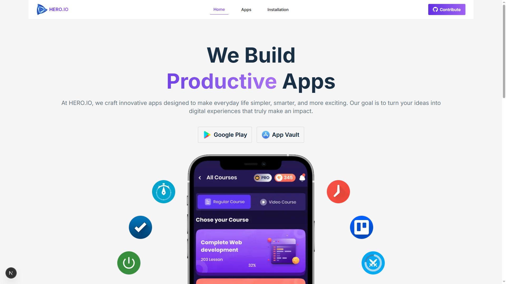
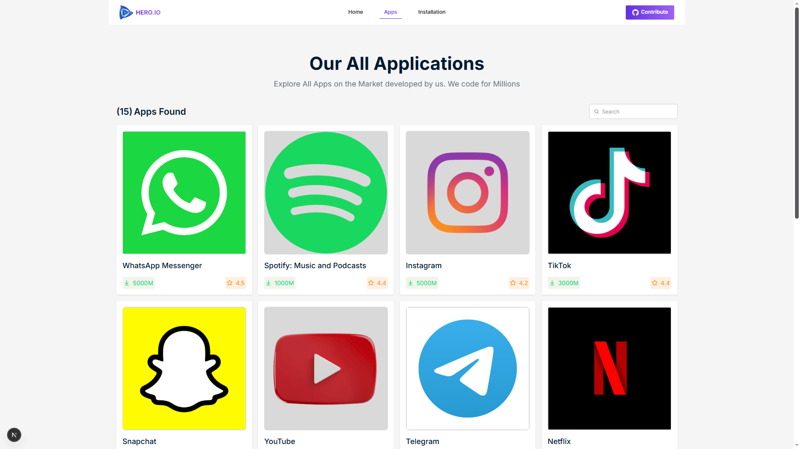
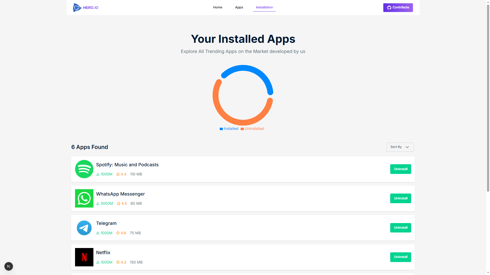

<div align="center">

# App Vault

### Discover, Install, and Manage Your Favorite Applications

A polished application discovery and management platform built with Next.js and React, where users can browse a curated app collection, inspect detailed app pages with ratings and usage stats, install or uninstall apps during the current session, and visualize install analytics through interactive charts.

[](https://apps-vault.vercel.app/)
[](https://nextjs.org/)
[](https://react.dev/)
[](https://tailwindcss.com/)
[](https://daisyui.com/)
[](https://recharts.org/)
[](https://apps-vault.vercel.app/)

</div>

---

## Preview

<p align="center">
  
</p>

<p align="center">
  
</p>

<p align="center">
  
</p>

> **Live Site:** [https://apps-vault.vercel.app/](https://apps-vault.vercel.app/)

---

## Features

| Feature | Description |
| :--- | :--- |
| Browse App Catalog | Explore a responsive collection of apps loaded from a local JSON dataset |
| Trending Apps Showcase | Homepage highlights the top 8 featured apps with quick access to the full catalog |
| Dynamic App Detail Pages | View dedicated detail pages with description, company info, download stats, reviews, and ratings |
| One-Click Install Flow | Install apps directly from the details page with duplicate prevention built in |
| Installed Apps Management | Review installed apps on a separate page and remove them anytime |
| Session-Based State | Installed app data is shared across pages through React Context during the active session |
| Installation Analytics | Visualize installed vs. uninstalled apps with an interactive donut chart |
| Rating Breakdown Charts | Each app includes a horizontal chart for 1-star to 5-star review distribution |
| Toast Notifications | Users receive instant install and uninstall feedback through React Toastify |
| Responsive Experience | Mobile-friendly navigation, adaptive card layouts, and a dedicated custom 404 page |

---

## Tech Stack

<div align="center">

| Technology | Purpose |
| :---: | :---: |
| **Next.js 15** | App Router, route-based layouts, metadata, and static app detail generation |
| **React 19** | Component-driven UI and client-side interactivity |
| **Tailwind CSS 4** | Utility-first styling and responsive layout system |
| **DaisyUI 5** | UI primitives used for buttons, dropdowns, cards, and inputs |
| **Recharts** | Install analytics and per-app rating visualization |
| **React Toastify** | Success and uninstall feedback toasts |
| **Lucide React / React Icons** | Interface iconography across cards, stats, and actions |
| **Local JSON Data** | App dataset served from `public/data.json` |
| **Vercel** | Deployment and hosting |

</div>

---

## Getting Started

### Prerequisites

- **Node.js** `18.18+`
- **npm** `9+`

### Installation

1. **Clone the repository**

   ```bash
   git clone <your-repository-url>
   cd App-Vault
   ```

2. **Install dependencies**

   ```bash
   npm install
   ```

3. **Start the development server**

   ```bash
   npm run dev
   ```

4. **Open in your browser**

   Visit `http://localhost:3000`

### Production Build

```bash
npm run build
npm run start
```

---

## Project Structure

```text
App-Vault/
|-- public/
|   |-- data.json
|   |-- favicon-logo.png
|   |-- preview1.png
|   |-- preview2.png
|   `-- preview3.png
|-- src/
|   |-- app/
|   |   |-- (public)/
|   |   |   |-- apps-page/
|   |   |   |   |-- [id]/page.jsx
|   |   |   |   `-- page.jsx
|   |   |   |-- installation-page/
|   |   |   |   `-- page.jsx
|   |   |   |-- layout.jsx
|   |   |   `-- page.js
|   |   |-- globals.css
|   |   |-- layout.jsx
|   |   |-- loading.jsx
|   |   `-- not-found.jsx
|   |-- assets/
|   |   `-- images/
|   |-- components/
|   |   |-- AppDetailsPage/
|   |   |-- AppsPage/
|   |   |-- homepage/
|   |   |-- InstallationPage/
|   |   `-- shared/
|   `-- context/
|       `-- AppContext/
|           `-- AppContextProvider.jsx
|-- eslint.config.mjs
|-- jsconfig.json
|-- next.config.mjs
|-- package.json
|-- postcss.config.mjs
`-- README.md
```

---

## Design Highlights

- Modern product-style landing page with a bold violet gradient accent system
- Strong hero section with marketplace-inspired CTA buttons and branded illustration
- Clean app cards that surface download counts, review stats, and ratings at a glance
- Dedicated app details layout with large visual focus and chart-based data presentation
- Installation dashboard that combines quick management actions with visual analytics
- Responsive navigation and layout behavior tuned for both mobile and desktop screens

---

## Data Source

This project uses a local app dataset stored in:

```text
public/data.json
```

Each app entry includes:

- App ID
- App title
- Company name
- Cover image URL
- Description
- App size
- Total reviews
- Average rating
- Download count
- Rating distribution data

---

## Deployment

The application is deployed on **Vercel**:

**Live URL:** [https://apps-vault.vercel.app/](https://apps-vault.vercel.app/)

---

<div align="center">

**If you found this project useful, consider giving it a star.**

Made with Next.js, React, Tailwind CSS, DaisyUI, Recharts, and React Toastify

</div>
